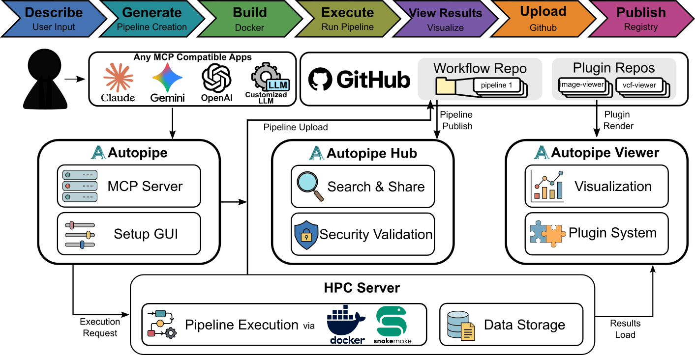
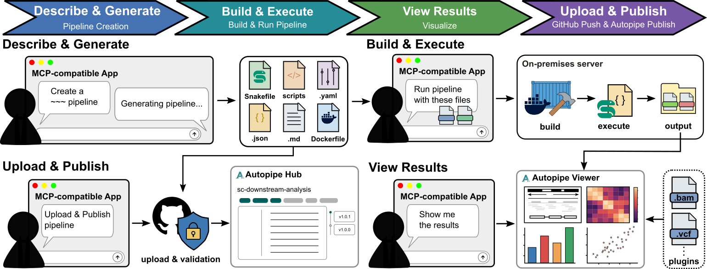

# AutoPipe

AutoPipe is an AI-powered platform for creating, executing, and sharing reproducible bioinformatics pipelines. It works as an MCP (Model Context Protocol) server, connecting to AI assistants like Claude, Gemini, and OpenAI — enabling researchers to build complete analysis workflows through natural language conversation.

  

  

## Key Features

### AI Pipeline Generation

Describe your analysis. AutoPipe works with any MCP-compatible AI application to automatically generate a complete Snakemake pipeline, including a Dockerfile for reproducible environments, a configuration file for parameters, and RO-Crate metadata for discoverability. The entire workflow — from natural language description to a ready-to-run pipeline — requires no bioinformatics coding expertise.

### Pipeline Execution on Remote Servers

Pipelines run inside Docker containers on HPC or remote servers connected via SSH. AutoPipe handles the full lifecycle: building Docker images, executing Snakemake workflows, monitoring logs, and reporting results — all through conversational AI interaction. Containerized execution ensures full reproducibility across different computing environments.

### Interactive Result Viewer

View pipeline outputs directly in the browser without downloading files. The built-in viewer supports genomics formats (BAM, VCF, BED, GFF, FASTA, FASTQ), scientific images (PNG, TIFF, SVG), data tables (CSV, TSV), HDF5, and PDF documents. The viewer is powered by an extensible plugin system — anyone can create and share custom visualization plugins through AutoPipeHub.

### Pipeline Registry (AutoPipeHub)

Browse existing workflows contributed by the community, fork and extend them with your own analysis steps, or publish your own pipelines for others to use. All pipelines are version-controlled on GitHub with full history tracking.

### Desktop Application with Setup GUI

The AutoPipe desktop app provides a graphical interface for configuring SSH connections, GitHub integration, and MCP server registration. Once set up, it runs as a background service that any MCP-compatible AI application can connect to. Available for macOS, Windows, and Linux.

## Links

AutoPipe is free and open source. Get started at **[autopipe.org](https://autopipe.org)**.

## License

This project is licensed under the BSD 3-Clause License - see the [LICENSE](LICENSE) file for details.